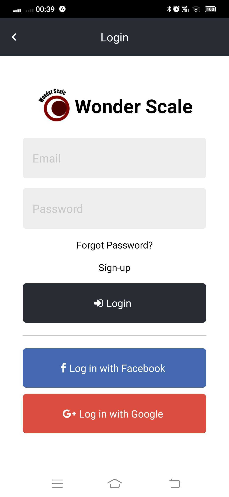
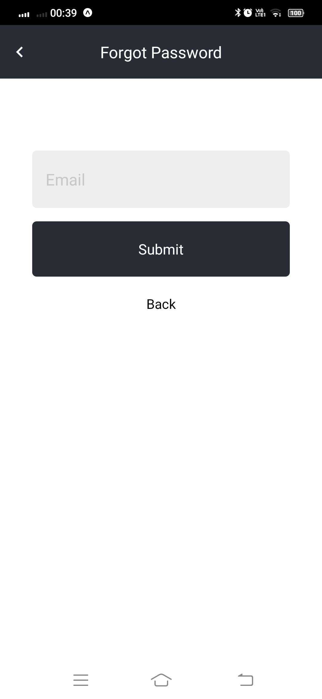
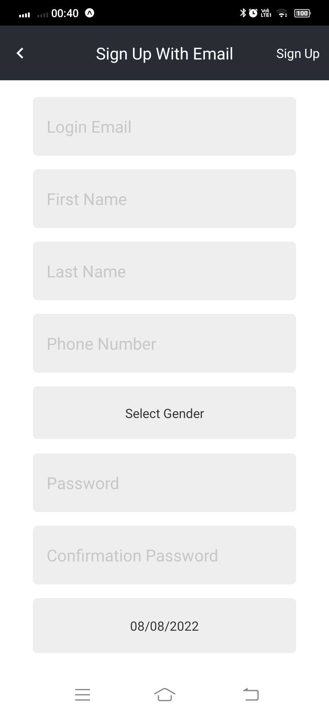
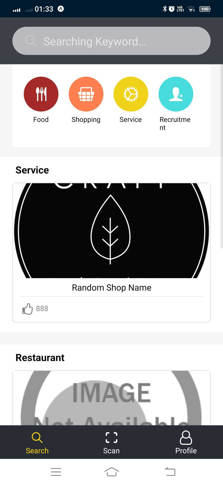
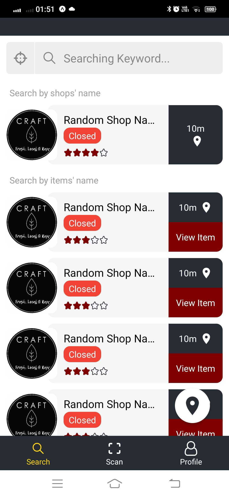
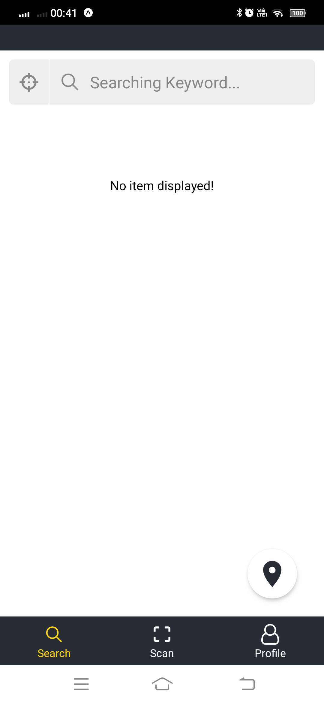
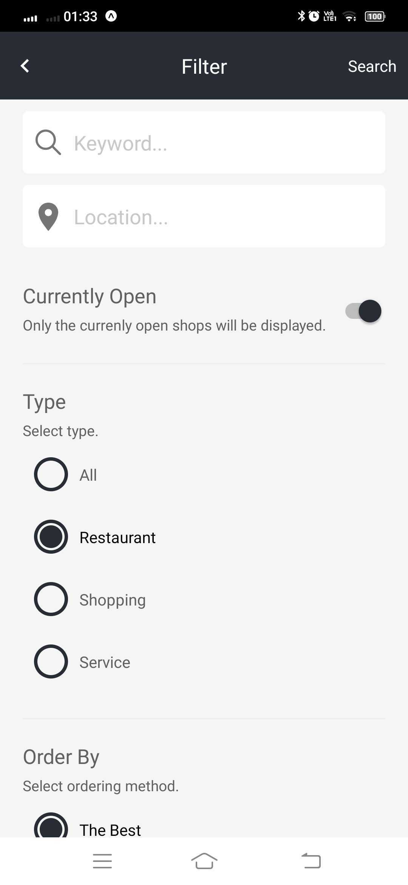
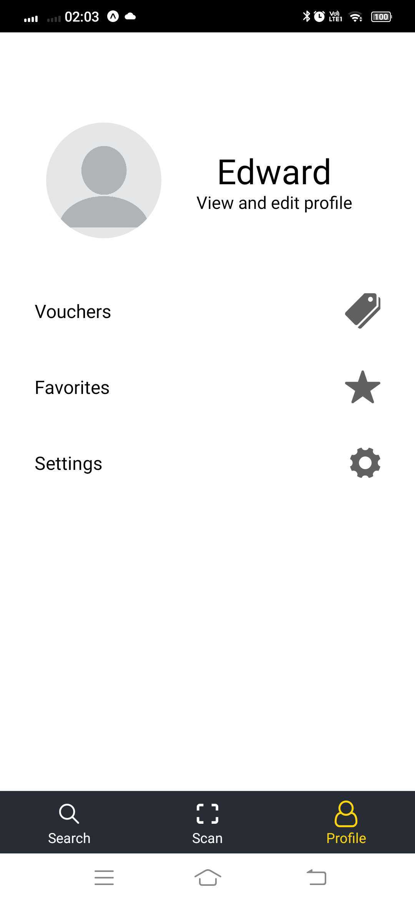
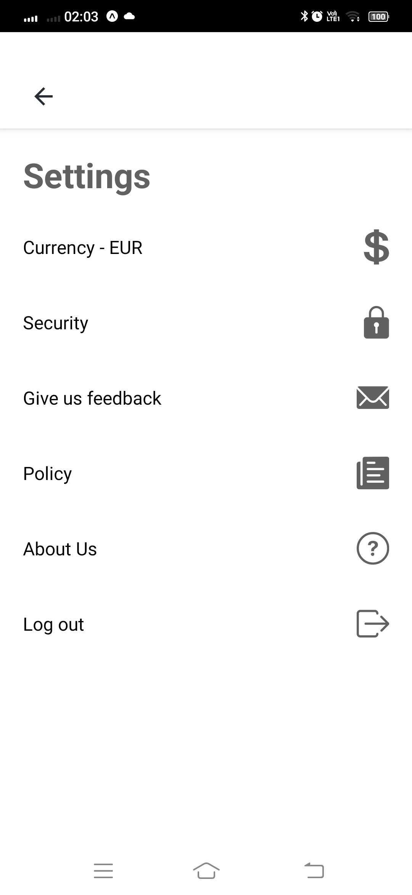

# Wonder Scale Mobile
A apps to display the information of the merchant's store. User can search the merchant and stores from the apps.
(!)The App requires to function well with server.

# Screenshots:
### Login Page:
<kbd></kbd>

### Forgot Password Page:
<kbd></kbd>

### Signup Page:
<kbd></kbd>

### Home List:
<kbd></kbd>

### Search Page With Items:
<kbd></kbd>

### Search Page Without Items:
<kbd></kbd>

### Search Page Filter:
<kbd></kbd>

### Profile Page:
<kbd></kbd>

### Profile Settings:
<kbd></kbd>

## Development server

Run `expo start` for a dev server. Using expo@2.11.4 app to run the apps successfully.

## Others

Kindly refer to [UI Design](./UI_Design) for the frontend of the apps.